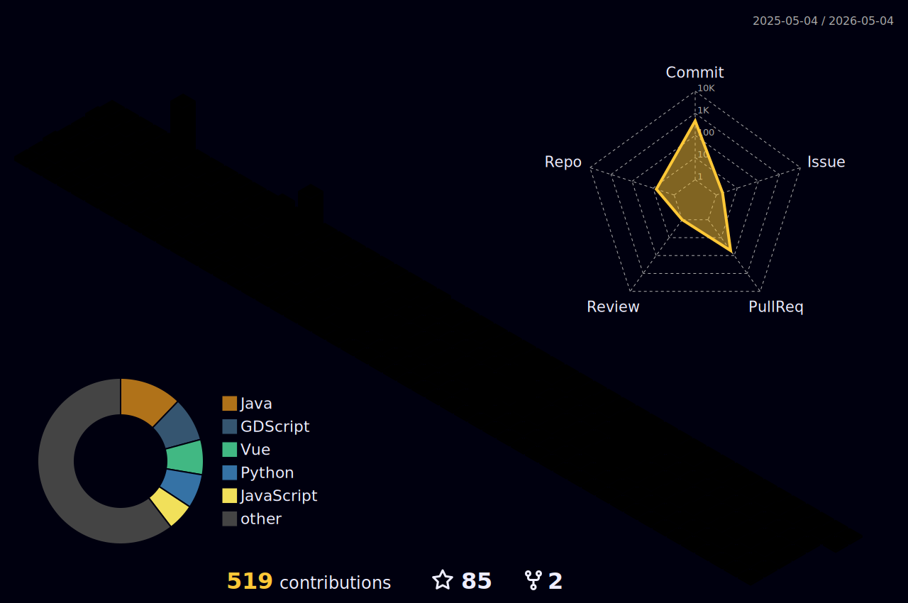

<h1 align="center">
    
</h1>

I am a developer and automation engineer passionate about AI-powered workflows, scalable testing systems, and modern software architecture.

When I'm not coding, you can find me playing **badminton** or exploring **machine learning** projects.

> "Build systems that make hard things feel simple." – Charles Vanzetta

---

## Skills & Technologies

- 💻 Languages: Java, Python, TypeScript
- 🧪 Test Automation: Playwright, CI/CD, ReportPortal
- 🧠 AI & Data: OCR, VLMs, FastAPI, Machine Learning
- 🌐 Frontend: Vue 3, React
- ⚙️ Tools: GitLab, Docker, Jira

---

## Most Used Languages

---

## GitHub Activity

---

## About Me

- 🏢 Consultant at **Fortil**
- 🎓 Bachelor's degree in Application Design & Development
- 🎓 Currently pursuing a Master's degree in Software Architecture & Development
- 🇫🇷 Based in France

---

## What I'm Working On

⚙️ **Playwright automation platform** for insurance workflows  
Building scalable domain-driven automated testing systems.

🧾 **AI-assisted document verification platform**  
OCR + VLM pipeline for automated validation of generated PDFs.

🤖 **AI-powered QA assistants**  
Exploring how LLMs and VLMs can improve testing workflows and anomaly detection.

📊 **Machine Learning & AI Engineering**  
Deepening knowledge in ML workflows, Python ecosystems, and intelligent automation systems.

---

## Find me online

- [LinkedIn](https://www.linkedin.com/in/charles-vanzetta/)
- [Portfolio](https://cvanzetta.github.io/Portfolio/)
