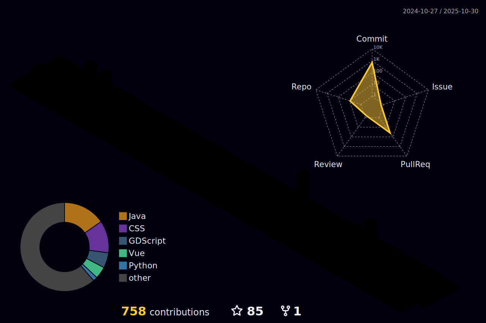

<h1 align="center">
    
</h1>

I am a passionate developer and consultant at Fortil.

When I'm not coding, you can find me playing **badminton** or exploring **machine learning** projects. I hold a bachelor's degree and love using my skills to solve challenging problems.

> "✨ Make sexy code that makes you look intelligent. 💻🧠" – Charles Vanzetta

## Skills & Technologies and Most Used Languages

| Skills  | Most Used Languages |
| ------------- | ------------- |
| - 💻 Languages: Java, Python, JavaScript   - 🌠Web Frameworks: React, Node.js, Vue.js   - 🧠 Interests: Machine Learning, Automation |  |

## About Me
- 🏢 Consultant at **Fortil**
- 🎓 Bachelor’s degree holder
- 🇫🇷 Based in France

## Find me online
- [LinkedIn](https://www.linkedin.com/in/charles-vanzetta/)
- [Portfolio](https://cvanzetta.github.io/Portfolio/)
## GitHub Stats

---
